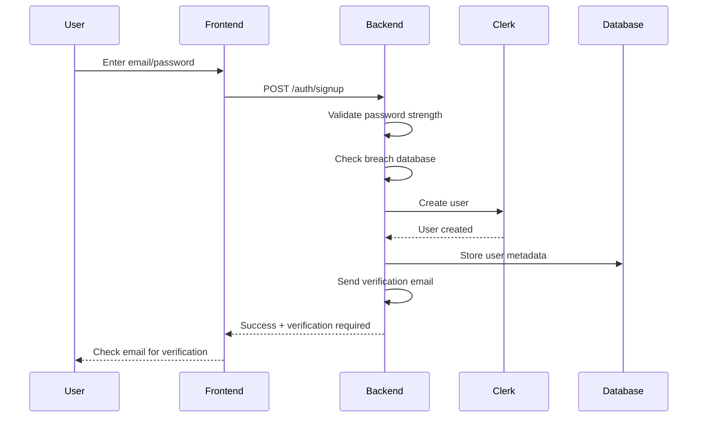
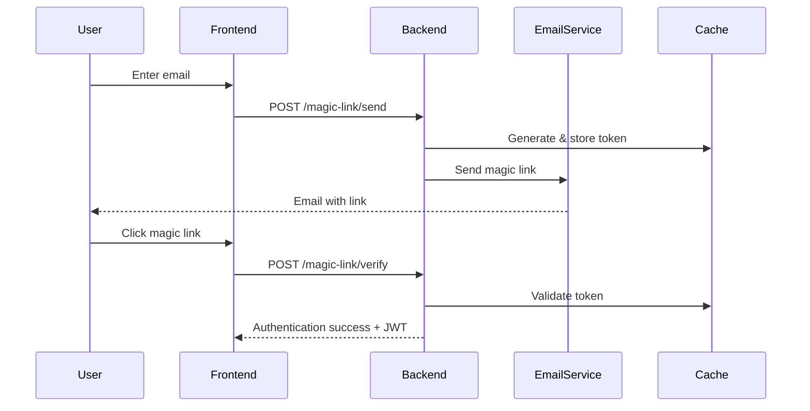
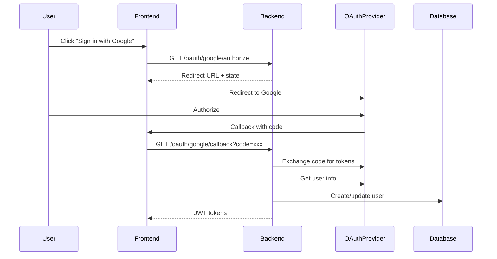
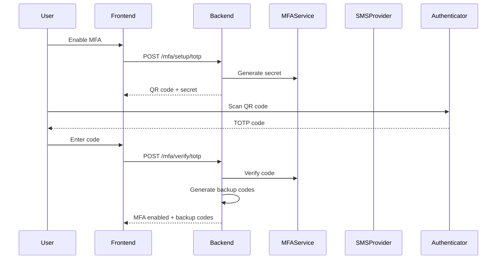
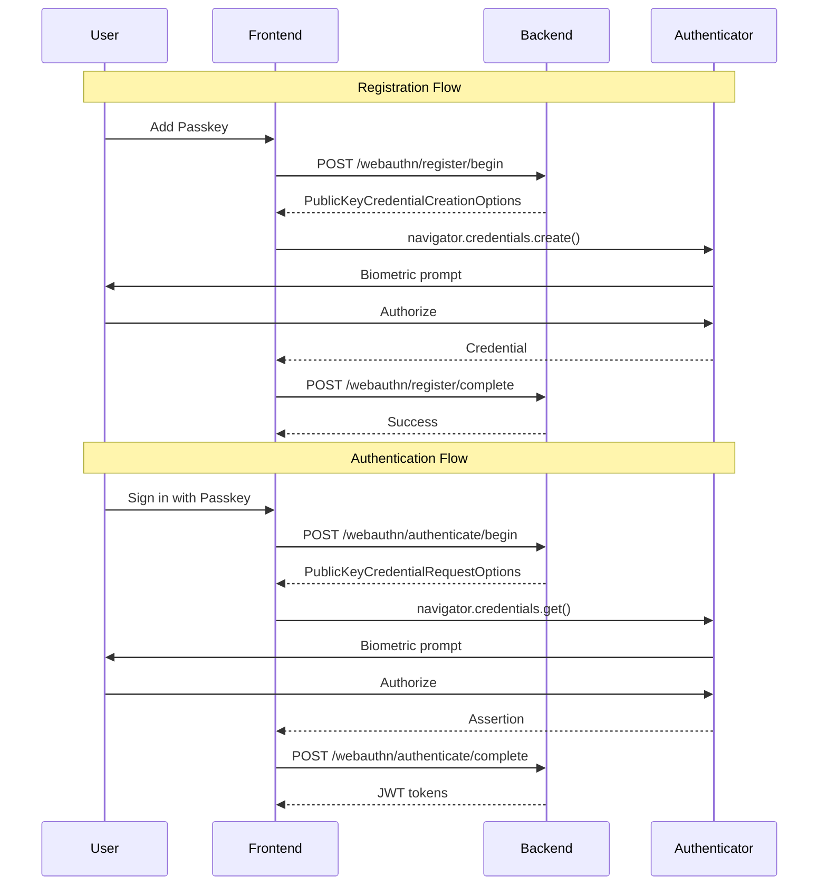
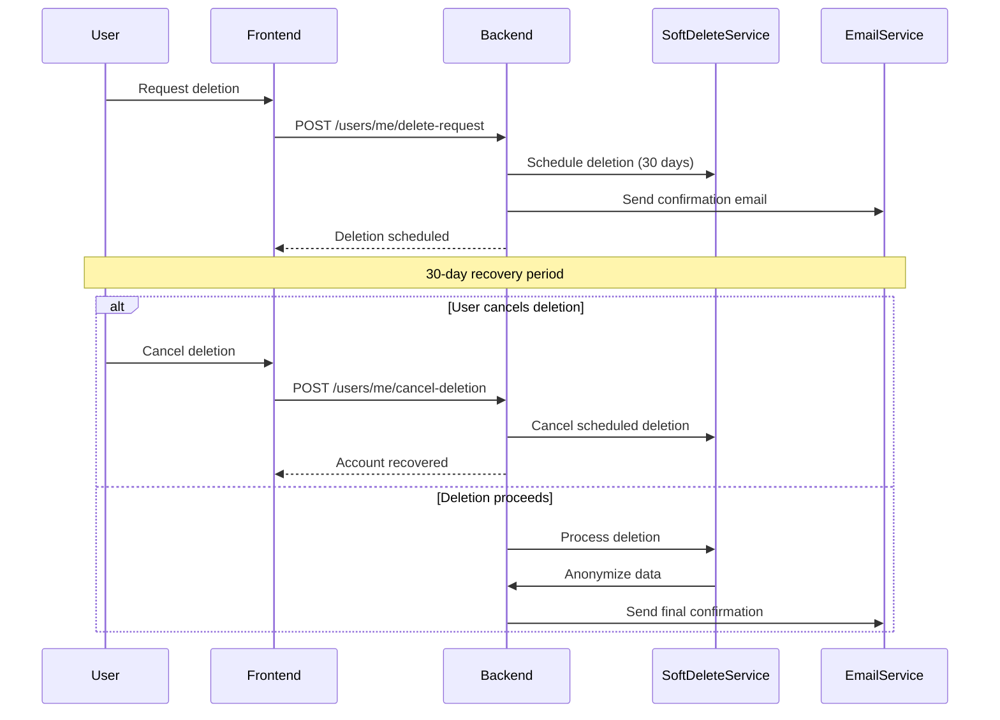

# FastAPI Clerk Auth - Complete Feature Flow Documentation

## Table of Contents
1. [Core Authentication Features](#1-core-authentication-features)
2. [Advanced Authentication Methods](#2-advanced-authentication-methods)
3. [User Management Features](#3-user-management-features)
4. [Organization & Multi-Tenancy](#4-organization--multi-tenancy)
5. [Security Features](#5-security-features)
6. [Session Management](#6-session-management)
7. [API & Integration Features](#7-api--integration-features)
8. [Enterprise Features](#8-enterprise-features)
9. [Compliance & Audit Features](#9-compliance--audit-features)
10. [Developer Experience](#10-developer-experience)

---

## 1. Core Authentication Features

### 1.1 Email/Password Authentication

#### Description
Traditional email and password-based authentication with comprehensive security features.

#### Purpose
- Provide familiar authentication method for users
- Ensure secure password management with breach detection
- Support password recovery and strength validation

#### API Endpoints
```
POST /api/v1/auth/signup
POST /api/v1/auth/login
POST /api/v1/auth/logout
POST /api/v1/auth/forgot-password
POST /api/v1/auth/reset-password
POST /api/v1/auth/verify-email
GET  /api/v1/auth/check-password-strength
```

#### Flow Diagram


#### Interactions with Other Features
- **Password Validator Service**: Checks password strength and breach status
- **Email Service**: Sends verification and password reset emails
- **Audit Service**: Logs authentication events
- **Rate Limiting**: Prevents brute force attacks
- **Session Management**: Creates session after successful login

#### Frontend Implementation Strategy
```typescript
// Example React implementation
interface AuthService {
  signup: (email: string, password: string) => Promise<AuthResponse>;
  login: (email: string, password: string) => Promise<AuthResponse>;
  verifyEmail: (token: string) => Promise<void>;
  forgotPassword: (email: string) => Promise<void>;
  resetPassword: (token: string, newPassword: string) => Promise<void>;
}

// Component example
const SignupForm: React.FC = () => {
  const [passwordStrength, setPasswordStrength] = useState<PasswordStrength>();
  
  const checkPassword = async (password: string) => {
    const response = await api.post('/auth/check-password-strength', { password });
    setPasswordStrength(response.data);
  };
  
  const handleSubmit = async (data: SignupData) => {
    try {
      // Check for breached password
      if (passwordStrength?.breached) {
        showWarning('This password has been found in data breaches');
        return;
      }
      
      const result = await authService.signup(data.email, data.password);
      if (result.requiresVerification) {
        navigate('/verify-email');
      }
    } catch (error) {
      handleAuthError(error);
    }
  };
};
```

#### Testing Criteria
- ✅ Password strength validation (min 8 chars, complexity requirements)
- ✅ Breach detection triggers warning
- ✅ Email verification required for new accounts
- ✅ Password reset token expires after 1 hour
- ✅ Rate limiting after 5 failed attempts
- ✅ Session created upon successful login
- ✅ Audit logs generated for all auth events

#### Security Considerations
- Passwords hashed with bcrypt (min 12 rounds)
- Password history prevents reuse of last 5 passwords
- Account lockout after 5 failed attempts (15 min)
- Secure token generation for email verification
- HTTPS required for all auth endpoints

---

### 1.2 Magic Link Authentication

#### Description
Passwordless authentication using time-limited email links.

#### Purpose
- Eliminate password management complexity
- Provide frictionless authentication experience
- Reduce account takeover risks from weak passwords

#### API Endpoints
```
POST /api/v1/passwordless/magic-link/send
POST /api/v1/passwordless/magic-link/verify
GET  /api/v1/passwordless/magic-link/status/{token}
```

#### Flow Diagram


#### Interactions with Other Features
- **Email Service**: Delivers magic links
- **Cache Service**: Stores temporary tokens (15 min TTL)
- **Session Management**: Creates session after verification
- **Geolocation Service**: Validates login location
- **Device Management**: Registers new devices

#### Frontend Implementation Strategy
```typescript
// Magic Link Component
const MagicLinkLogin: React.FC = () => {
  const [emailSent, setEmailSent] = useState(false);
  const [countdown, setCountdown] = useState(0);
  
  const sendMagicLink = async (email: string) => {
    const response = await api.post('/passwordless/magic-link/send', {
      email,
      redirect_url: `${window.location.origin}/auth/callback`
    });
    
    setEmailSent(true);
    setCountdown(60); // Prevent spam
    startCountdown();
  };
  
  // Handle magic link callback
  useEffect(() => {
    const token = new URLSearchParams(location.search).get('token');
    if (token) {
      verifyMagicLink(token);
    }
  }, [location]);
  
  const verifyMagicLink = async (token: string) => {
    try {
      const response = await api.post('/passwordless/magic-link/verify', {
        token,
        device_fingerprint: await getDeviceFingerprint()
      });
      
      // Store tokens
      localStorage.setItem('access_token', response.data.access_token);
      localStorage.setItem('refresh_token', response.data.refresh_token);
      
      // Redirect to dashboard
      navigate('/dashboard');
    } catch (error) {
      if (error.code === 'TOKEN_EXPIRED') {
        showError('Magic link expired. Please request a new one.');
      }
    }
  };
};
```

#### Testing Criteria
- ✅ Magic link expires after 15 minutes
- ✅ Token single-use enforcement
- ✅ IP validation if strict mode enabled
- ✅ Rate limiting (5 requests per hour per email)
- ✅ Email delivery confirmation
- ✅ Device fingerprinting on verification

#### Security Considerations
- Cryptographically secure token generation
- Optional IP address binding
- Single-use token enforcement
- Rate limiting to prevent email bombing
- Secure redirect URL validation

---

### 1.3 OAuth Social Authentication

#### Description
Integration with 20+ OAuth providers for social login.

#### Purpose
- Reduce signup friction with one-click authentication
- Leverage existing trusted identity providers
- Support multiple linked accounts per user

#### Supported Providers
- Google, GitHub, Microsoft, Facebook, Twitter/X, LinkedIn
- Discord, Slack, Spotify, TikTok, Twitch, Apple
- GitLab, Bitbucket, Instagram, Dropbox, Notion
- Linear, Box, HubSpot, Atlassian

#### API Endpoints
```
GET  /api/v1/oauth/providers
GET  /api/v1/oauth/{provider}/authorize
GET  /api/v1/oauth/{provider}/callback
POST /api/v1/oauth/{provider}/link
DELETE /api/v1/oauth/{provider}/unlink
GET  /api/v1/oauth/connections
```

#### Flow Diagram


#### Frontend Implementation Strategy
```typescript
// OAuth Service
class OAuthService {
  async initiateOAuth(provider: string): Promise<void> {
    // Get authorization URL
    const response = await api.get(`/oauth/${provider}/authorize`, {
      params: {
        redirect_uri: `${window.location.origin}/auth/callback`,
        state: generateState()
      }
    });
    
    // Store state for CSRF protection
    sessionStorage.setItem('oauth_state', response.data.state);
    
    // Redirect to provider
    window.location.href = response.data.authorization_url;
  }
  
  async handleCallback(): Promise<AuthTokens> {
    const params = new URLSearchParams(location.search);
    const code = params.get('code');
    const state = params.get('state');
    
    // Verify state
    if (state !== sessionStorage.getItem('oauth_state')) {
      throw new Error('Invalid state parameter');
    }
    
    // Exchange code for tokens
    const response = await api.get('/oauth/callback', {
      params: { code, state }
    });
    
    return response.data;
  }
  
  async linkAccount(provider: string): Promise<void> {
    // Link additional OAuth account
    await api.post(`/oauth/${provider}/link`, {
      access_token: getCurrentAccessToken()
    });
  }
  
  async getConnections(): Promise<OAuthConnection[]> {
    const response = await api.get('/oauth/connections');
    return response.data;
  }
}

// React Component
const SocialLoginButtons: React.FC = () => {
  const oauth = new OAuthService();
  const [connections, setConnections] = useState<OAuthConnection[]>([]);
  
  useEffect(() => {
    loadConnections();
  }, []);
  
  const loadConnections = async () => {
    const data = await oauth.getConnections();
    setConnections(data);
  };
  
  const handleProviderClick = async (provider: string) => {
    try {
      await oauth.initiateOAuth(provider);
    } catch (error) {
      console.error(`OAuth failed for ${provider}:`, error);
    }
  };
  
  return (
    <div className="social-login-grid">
      {PROVIDERS.map(provider => (
        <button
          key={provider.id}
          onClick={() => handleProviderClick(provider.id)}
          disabled={connections.some(c => c.provider === provider.id)}
          className={`oauth-button ${provider.id}`}
        >
          <provider.Icon />
          {connections.some(c => c.provider === provider.id) 
            ? `Connected` 
            : `Sign in with ${provider.name}`}
        </button>
      ))}
    </div>
  );
};
```

#### Testing Criteria
- ✅ State parameter validation for CSRF protection
- ✅ Provider token encryption at rest
- ✅ Account linking for existing users
- ✅ Multiple provider connections per user
- ✅ Graceful handling of provider errors
- ✅ Token refresh mechanism
- ✅ Provider-specific scope requests

---

## 2. Advanced Authentication Methods

### 2.1 Multi-Factor Authentication (MFA)

#### Description
Comprehensive MFA support including TOTP, SMS, Email, and backup codes.

#### Purpose
- Add additional security layer beyond passwords
- Comply with enterprise security requirements
- Provide multiple MFA options for user convenience

#### API Endpoints
```
POST /api/v1/mfa/enable
POST /api/v1/mfa/disable
POST /api/v1/mfa/setup/totp
POST /api/v1/mfa/verify/totp
POST /api/v1/mfa/setup/sms
POST /api/v1/mfa/verify/sms
POST /api/v1/mfa/backup-codes/generate
POST /api/v1/mfa/backup-codes/verify
GET  /api/v1/mfa/status
POST /api/v1/mfa/trusted-device/add
```

#### Flow Diagram


#### Frontend Implementation Strategy
```typescript
// MFA Setup Component
const MFASetup: React.FC = () => {
  const [step, setStep] = useState<'choose' | 'setup' | 'verify' | 'complete'>('choose');
  const [mfaMethod, setMfaMethod] = useState<'totp' | 'sms' | 'email'>();
  const [qrCode, setQrCode] = useState<string>();
  const [backupCodes, setBackupCodes] = useState<string[]>();
  
  const setupTOTP = async () => {
    const response = await api.post('/mfa/setup/totp');
    setQrCode(response.data.qr_code);
    setStep('verify');
  };
  
  const verifyTOTP = async (code: string) => {
    try {
      const response = await api.post('/mfa/verify/totp', { code });
      setBackupCodes(response.data.backup_codes);
      setStep('complete');
    } catch (error) {
      if (error.code === 'INVALID_CODE') {
        showError('Invalid code. Please try again.');
      }
    }
  };
  
  const downloadBackupCodes = () => {
    const blob = new Blob([backupCodes.join('\n')], { type: 'text/plain' });
    const url = URL.createObjectURL(blob);
    const a = document.createElement('a');
    a.href = url;
    a.download = 'backup-codes.txt';
    a.click();
  };
  
  return (
    <div className="mfa-setup">
      {step === 'choose' && (
        <MFAMethodSelector onSelect={setMfaMethod} />
      )}
      
      {step === 'setup' && mfaMethod === 'totp' && (
        <div>
          <QRCode value={qrCode} />
          <p>Scan with your authenticator app</p>
          <CodeInput onSubmit={verifyTOTP} />
        </div>
      )}
      
      {step === 'complete' && (
        <div>
          <h3>MFA Enabled Successfully!</h3>
          <div className="backup-codes">
            <h4>Save your backup codes:</h4>
            {backupCodes.map(code => (
              <code key={code}>{code}</code>
            ))}
            <button onClick={downloadBackupCodes}>Download Codes</button>
          </div>
        </div>
      )}
    </div>
  );
};

// MFA Challenge Component
const MFAChallenge: React.FC<{onSuccess: () => void}> = ({ onSuccess }) => {
  const [method, setMethod] = useState<'totp' | 'sms' | 'backup'>('totp');
  const [codeSent, setCodeSent] = useState(false);
  
  const sendSMSCode = async () => {
    await api.post('/mfa/send-sms');
    setCodeSent(true);
    startCountdown(60);
  };
  
  const verifyCode = async (code: string) => {
    try {
      const endpoint = method === 'backup' 
        ? '/mfa/backup-codes/verify'
        : `/mfa/verify/${method}`;
        
      const response = await api.post(endpoint, { code });
      
      // Store MFA token
      sessionStorage.setItem('mfa_verified', 'true');
      sessionStorage.setItem('mfa_token', response.data.mfa_token);
      
      onSuccess();
    } catch (error) {
      handleMFAError(error);
    }
  };
  
  return (
    <div className="mfa-challenge">
      <MethodTabs selected={method} onChange={setMethod} />
      
      {method === 'sms' && !codeSent && (
        <button onClick={sendSMSCode}>Send Code to Phone</button>
      )}
      
      {(method === 'totp' || codeSent) && (
        <CodeInput
          length={6}
          onComplete={verifyCode}
          placeholder="Enter 6-digit code"
        />
      )}
      
      {method === 'backup' && (
        <input
          type="text"
          placeholder="Enter backup code"
          onKeyPress={(e) => {
            if (e.key === 'Enter') {
              verifyCode(e.currentTarget.value);
            }
          }}
        />
      )}
    </div>
  );
};
```

#### Testing Criteria
- ✅ TOTP codes valid for 30-second window
- ✅ SMS codes expire after 5 minutes
- ✅ Backup codes are single-use
- ✅ Rate limiting on verification attempts
- ✅ Trusted device bypass works for 30 days
- ✅ MFA required for sensitive operations

---

### 2.2 WebAuthn/Passkeys Authentication

#### Description
FIDO2-compliant biometric authentication using platform authenticators and security keys.

#### Purpose
- Enable passwordless biometric authentication
- Support platform authenticators (Face ID, Touch ID, Windows Hello)
- Support security keys (YubiKey, etc.)

#### API Endpoints
```
POST /api/v1/webauthn/register/begin
POST /api/v1/webauthn/register/complete
POST /api/v1/webauthn/authenticate/begin
POST /api/v1/webauthn/authenticate/complete
GET  /api/v1/webauthn/credentials
DELETE /api/v1/webauthn/credentials/{id}
PUT  /api/v1/webauthn/credentials/{id}/rename
```

#### Flow Diagram


#### Frontend Implementation Strategy
```typescript
// WebAuthn Service
class WebAuthnService {
  async registerPasskey(name: string): Promise<void> {
    // Check browser support
    if (!window.PublicKeyCredential) {
      throw new Error('WebAuthn not supported');
    }
    
    // Get registration options
    const optionsResponse = await api.post('/webauthn/register/begin', {
      authenticator_attachment: 'platform', // or 'cross-platform'
      user_verification: 'preferred'
    });
    
    const options = optionsResponse.data.publicKey;
    
    // Convert base64 to ArrayBuffer
    options.challenge = base64ToArrayBuffer(options.challenge);
    options.user.id = base64ToArrayBuffer(options.user.id);
    
    if (options.excludeCredentials) {
      options.excludeCredentials = options.excludeCredentials.map(cred => ({
        ...cred,
        id: base64ToArrayBuffer(cred.id)
      }));
    }
    
    try {
      // Create credential
      const credential = await navigator.credentials.create({
        publicKey: options
      }) as PublicKeyCredential;
      
      // Send to backend
      const response = credential.response as AuthenticatorAttestationResponse;
      
      await api.post('/webauthn/register/complete', {
        credential_id: arrayBufferToBase64(credential.rawId),
        client_data_json: arrayBufferToBase64(response.clientDataJSON),
        attestation_object: arrayBufferToBase64(response.attestationObject),
        credential_name: name
      });
      
      showSuccess('Passkey registered successfully!');
    } catch (error) {
      if (error.name === 'NotAllowedError') {
        showError('Registration was cancelled or timed out');
      }
      throw error;
    }
  }
  
  async authenticateWithPasskey(): Promise<AuthTokens> {
    // Get authentication options
    const optionsResponse = await api.post('/webauthn/authenticate/begin', {
      user_verification: 'preferred'
    });
    
    const options = optionsResponse.data.publicKey;
    const challengeId = optionsResponse.data.challenge_id;
    
    // Convert base64
    options.challenge = base64ToArrayBuffer(options.challenge);
    
    if (options.allowCredentials) {
      options.allowCredentials = options.allowCredentials.map(cred => ({
        ...cred,
        id: base64ToArrayBuffer(cred.id)
      }));
    }
    
    try {
      // Get assertion
      const assertion = await navigator.credentials.get({
        publicKey: options
      }) as PublicKeyCredential;
      
      const response = assertion.response as AuthenticatorAssertionResponse;
      
      // Complete authentication
      const authResponse = await api.post('/webauthn/authenticate/complete', {
        challenge_id: challengeId,
        credential_id: arrayBufferToBase64(assertion.rawId),
        client_data_json: arrayBufferToBase64(response.clientDataJSON),
        authenticator_data: arrayBufferToBase64(response.authenticatorData),
        signature: arrayBufferToBase64(response.signature),
        user_handle: response.userHandle 
          ? arrayBufferToBase64(response.userHandle) 
          : null
      });
      
      return authResponse.data;
    } catch (error) {
      if (error.name === 'NotAllowedError') {
        showError('Authentication was cancelled');
      }
      throw error;
    }
  }
}

// React Component
const PasskeyManager: React.FC = () => {
  const [passkeys, setPasskeys] = useState<Passkey[]>([]);
  const [isRegistering, setIsRegistering] = useState(false);
  const webauthn = new WebAuthnService();
  
  useEffect(() => {
    loadPasskeys();
  }, []);
  
  const loadPasskeys = async () => {
    const response = await api.get('/webauthn/credentials');
    setPasskeys(response.data);
  };
  
  const addPasskey = async () => {
    setIsRegistering(true);
    try {
      const name = await promptForName();
      await webauthn.registerPasskey(name);
      await loadPasskeys();
    } catch (error) {
      console.error('Failed to add passkey:', error);
    } finally {
      setIsRegistering(false);
    }
  };
  
  const deletePasskey = async (id: string) => {
    if (passkeys.length === 1) {
      showError('Cannot delete your last passkey');
      return;
    }
    
    if (confirm('Delete this passkey?')) {
      await api.delete(`/webauthn/credentials/${id}`);
      await loadPasskeys();
    }
  };
  
  return (
    <div className="passkey-manager">
      <h3>Passkeys</h3>
      <p>Sign in with biometrics, facial recognition, or security keys</p>
      
      <div className="passkey-list">
        {passkeys.map(passkey => (
          <div key={passkey.id} className="passkey-item">
            <div>
              <strong>{passkey.name}</strong>
              <small>Added {formatDate(passkey.created_at)}</small>
              {passkey.last_used_at && (
                <small>Last used {formatDate(passkey.last_used_at)}</small>
              )}
            </div>
            <button onClick={() => deletePasskey(passkey.id)}>Remove</button>
          </div>
        ))}
      </div>
      
      <button 
        onClick={addPasskey} 
        disabled={isRegistering}
        className="add-passkey-btn"
      >
        {isRegistering ? 'Setting up...' : 'Add Passkey'}
      </button>
    </div>
  );
};
```

#### Testing Criteria
- ✅ Platform authenticator detection
- ✅ Credential exclusion for duplicates
- ✅ User verification requirement
- ✅ Backup credential support
- ✅ Cross-device passkey sync
- ✅ Sign count verification

---

## 3. User Management Features

### 3.1 User Profile Management

#### Description
Comprehensive user profile system with metadata, avatars, and preferences.

#### Purpose
- Store and manage user information
- Support custom metadata fields
- Handle profile images and preferences

#### API Endpoints
```
GET  /api/v1/users/me
PUT  /api/v1/users/me
DELETE /api/v1/users/me
POST /api/v1/users/me/avatar
DELETE /api/v1/users/me/avatar
PUT  /api/v1/users/me/metadata
GET  /api/v1/users/{id} (admin only)
GET  /api/v1/users (admin only)
```

#### Frontend Implementation Strategy
```typescript
// User Profile Component
const UserProfile: React.FC = () => {
  const [profile, setProfile] = useState<UserProfile>();
  const [isEditing, setIsEditing] = useState(false);
  const [avatarFile, setAvatarFile] = useState<File>();
  
  const updateProfile = async (data: Partial<UserProfile>) => {
    const response = await api.put('/users/me', data);
    setProfile(response.data);
    showSuccess('Profile updated');
  };
  
  const uploadAvatar = async (file: File) => {
    const formData = new FormData();
    formData.append('avatar', file);
    
    const response = await api.post('/users/me/avatar', formData, {
      headers: { 'Content-Type': 'multipart/form-data' }
    });
    
    setProfile(prev => ({
      ...prev!,
      avatar_url: response.data.avatar_url
    }));
  };
  
  const updateMetadata = async (metadata: Record<string, any>) => {
    await api.put('/users/me/metadata', {
      public_metadata: metadata.public,
      private_metadata: metadata.private,
      unsafe_metadata: metadata.unsafe
    });
  };
  
  return (
    <div className="user-profile">
      <AvatarUploader
        current={profile?.avatar_url}
        onUpload={uploadAvatar}
      />
      
      <ProfileForm
        profile={profile}
        isEditing={isEditing}
        onSubmit={updateProfile}
      />
      
      <MetadataEditor
        metadata={{
          public: profile?.public_metadata,
          private: profile?.private_metadata,
          unsafe: profile?.unsafe_metadata
        }}
        onSave={updateMetadata}
      />
      
      <DangerZone onDeleteAccount={() => deleteAccount()} />
    </div>
  );
};
```

---

### 3.2 Account Deletion with GDPR Compliance

#### Description
Soft deletion system with recovery period and GDPR-compliant data handling.

#### Purpose
- Comply with GDPR "right to be forgotten"
- Provide recovery period for accidental deletions
- Support data export before deletion

#### API Endpoints
```
POST /api/v1/users/me/delete-request
POST /api/v1/users/me/cancel-deletion
GET  /api/v1/users/me/deletion-status
POST /api/v1/gdpr/export-data
GET  /api/v1/gdpr/download-export/{id}
POST /api/v1/gdpr/anonymize
```

#### Flow Diagram


#### Frontend Implementation Strategy
```typescript
const AccountDeletion: React.FC = () => {
  const [deletionStatus, setDeletionStatus] = useState<DeletionStatus>();
  const [exportReady, setExportReady] = useState(false);
  
  const requestDeletion = async (reason: string) => {
    // First, export data
    const exportResponse = await api.post('/gdpr/export-data');
    const exportId = exportResponse.data.export_id;
    
    // Request deletion
    const response = await api.post('/users/me/delete-request', {
      reason,
      recovery_period_days: 30,
      data_categories: ['personal_data', 'usage_data']
    });
    
    setDeletionStatus(response.data);
    
    // Download export
    window.open(`/api/v1/gdpr/download-export/${exportId}`, '_blank');
  };
  
  const cancelDeletion = async () => {
    const token = deletionStatus?.recovery_token;
    await api.post('/users/me/cancel-deletion', { 
      recovery_token: token 
    });
    
    setDeletionStatus(null);
    showSuccess('Account deletion cancelled');
  };
  
  return (
    <div className="account-deletion">
      {!deletionStatus ? (
        <div>
          <h3>Delete Your Account</h3>
          <Warning>
            This will schedule your account for deletion in 30 days.
            You can cancel anytime before then.
          </Warning>
          <button onClick={() => requestDeletion('user_request')}>
            Request Account Deletion
          </button>
        </div>
      ) : (
        <div>
          <h3>Account Scheduled for Deletion</h3>
          <p>Your account will be deleted on: {deletionStatus.scheduled_date}</p>
          <p>Days remaining: {deletionStatus.remaining_days}</p>
          <button onClick={cancelDeletion}>Cancel Deletion</button>
        </div>
      )}
    </div>
  );
};
```

---

## 4. Organization & Multi-Tenancy

### 4.1 Organization Management

#### Description
Multi-tenant organization system with member management and permissions.

#### Purpose
- Enable B2B SaaS multi-tenancy
- Manage organization members and roles
- Support organization-level settings

#### API Endpoints
```
POST /api/v1/organizations
GET  /api/v1/organizations
GET  /api/v1/organizations/{id}
PUT  /api/v1/organizations/{id}
DELETE /api/v1/organizations/{id}
GET  /api/v1/organizations/{id}/members
POST /api/v1/organizations/{id}/members
DELETE /api/v1/organizations/{id}/members/{user_id}
PUT  /api/v1/organizations/{id}/members/{user_id}/role
```

#### Frontend Implementation Strategy
```typescript
// Organization Context
const OrganizationProvider: React.FC = ({ children }) => {
  const [currentOrg, setCurrentOrg] = useState<Organization>();
  const [organizations, setOrganizations] = useState<Organization[]>([]);
  const [members, setMembers] = useState<OrganizationMember[]>([]);
  
  const createOrganization = async (data: CreateOrgData) => {
    const response = await api.post('/organizations', data);
    const newOrg = response.data;
    setOrganizations([...organizations, newOrg]);
    setCurrentOrg(newOrg);
    return newOrg;
  };
  
  const inviteMember = async (email: string, role: string) => {
    await api.post(`/organizations/${currentOrg.id}/invitations`, {
      email,
      role,
      message: `Join ${currentOrg.name} on our platform`
    });
  };
  
  const switchOrganization = async (orgId: string) => {
    const org = organizations.find(o => o.id === orgId);
    setCurrentOrg(org);
    
    // Update API client headers
    api.defaults.headers['X-Organization-Id'] = orgId;
    
    // Reload organization-specific data
    await loadOrganizationData(orgId);
  };
  
  return (
    <OrganizationContext.Provider value={{
      currentOrg,
      organizations,
      members,
      createOrganization,
      inviteMember,
      switchOrganization
    }}>
      {children}
    </OrganizationContext.Provider>
  );
};

// Organization Switcher Component
const OrganizationSwitcher: React.FC = () => {
  const { currentOrg, organizations, switchOrganization } = useOrganization();
  const [isOpen, setIsOpen] = useState(false);
  
  return (
    <Dropdown open={isOpen} onOpenChange={setIsOpen}>
      <DropdownTrigger>
        <button className="org-switcher">
          <OrgIcon src={currentOrg?.logo_url} />
          <span>{currentOrg?.name}</span>
          <ChevronDown />
        </button>
      </DropdownTrigger>
      
      <DropdownContent>
        {organizations.map(org => (
          <DropdownItem
            key={org.id}
            onClick={() => switchOrganization(org.id)}
            selected={org.id === currentOrg?.id}
          >
            <OrgIcon src={org.logo_url} />
            <div>
              <div>{org.name}</div>
              <small>{org.member_count} members</small>
            </div>
          </DropdownItem>
        ))}
        
        <DropdownSeparator />
        
        <DropdownItem onClick={() => navigate('/organizations/new')}>
          <PlusIcon />
          Create Organization
        </DropdownItem>
      </DropdownContent>
    </Dropdown>
  );
};
```

---

### 4.2 Workspace/Teams Features

#### Description
Sub-organization workspaces for team collaboration and resource isolation.

#### Purpose
- Create isolated workspaces within organizations
- Manage team-specific permissions and resources
- Support cross-team collaboration

#### API Endpoints
```
POST /api/v1/workspaces
GET  /api/v1/workspaces
GET  /api/v1/workspaces/{id}
PUT  /api/v1/workspaces/{id}
DELETE /api/v1/workspaces/{id}
POST /api/v1/workspaces/{id}/members
DELETE /api/v1/workspaces/{id}/members/{user_id}
PUT  /api/v1/workspaces/{id}/members/{user_id}/role
GET  /api/v1/workspaces/{id}/quota
POST /api/v1/workspaces/{id}/transfer-ownership
```

#### Frontend Implementation Strategy
```typescript
// Workspace Management
const WorkspaceManager: React.FC = () => {
  const [workspaces, setWorkspaces] = useState<Workspace[]>([]);
  const [currentWorkspace, setCurrentWorkspace] = useState<Workspace>();
  const [quota, setQuota] = useState<WorkspaceQuota>();
  
  const createWorkspace = async (data: CreateWorkspaceData) => {
    const response = await api.post('/workspaces', {
      name: data.name,
      description: data.description,
      settings: {
        max_members: 100,
        max_projects: 50,
        allow_guest_access: false
      },
      features: {
        analytics: true,
        api_access: true,
        webhooks: true
      }
    });
    
    const workspace = response.data;
    setWorkspaces([...workspaces, workspace]);
    return workspace;
  };
  
  const loadQuota = async (workspaceId: string) => {
    const response = await api.get(`/workspaces/${workspaceId}/quota`);
    setQuota(response.data);
  };
  
  return (
    <div className="workspace-manager">
      <WorkspaceList
        workspaces={workspaces}
        current={currentWorkspace}
        onSelect={setCurrentWorkspace}
        onCreate={createWorkspace}
      />
      
      {currentWorkspace && (
        <>
          <WorkspaceSettings
            workspace={currentWorkspace}
            onUpdate={(data) => updateWorkspace(currentWorkspace.id, data)}
          />
          
          <WorkspaceMembers
            workspaceId={currentWorkspace.id}
            canManage={currentWorkspace.user_role === 'owner'}
          />
          
          <WorkspaceQuota quota={quota} />
        </>
      )}
    </div>
  );
};
```

---

### 4.3 Custom Roles & Permissions

#### Description
Granular role-based access control with custom roles and permission hierarchies.

#### Purpose
- Create organization-specific roles
- Define granular permissions
- Support role inheritance and hierarchies

#### API Endpoints
```
POST /api/v1/organizations/{id}/roles
GET  /api/v1/organizations/{id}/roles
PUT  /api/v1/organizations/{id}/roles/{role_id}
DELETE /api/v1/organizations/{id}/roles/{role_id}
POST /api/v1/organizations/{id}/roles/{role_id}/permissions
GET  /api/v1/users/me/permissions
POST /api/v1/rbac/check-permission
```

#### Frontend Implementation Strategy
```typescript
// Role Management Component
const RoleManager: React.FC = () => {
  const [roles, setRoles] = useState<CustomRole[]>([]);
  const [selectedRole, setSelectedRole] = useState<CustomRole>();
  const [permissions, setPermissions] = useState<Permission[]>([]);
  
  const createRole = async (data: CreateRoleData) => {
    const response = await api.post(`/organizations/${orgId}/roles`, {
      name: data.name,
      description: data.description,
      permissions: data.permissions,
      parent_role_id: data.parentRole,
      priority: data.priority
    });
    
    setRoles([...roles, response.data]);
  };
  
  const updatePermissions = async (roleId: string, permissions: Permission[]) => {
    await api.put(`/organizations/${orgId}/roles/${roleId}`, {
      permissions: permissions.map(p => ({
        resource: p.resource,
        action: p.action,
        scope: p.scope,
        conditions: p.conditions
      }))
    });
  };
  
  return (
    <div className="role-manager">
      <RoleList
        roles={roles}
        selected={selectedRole}
        onSelect={setSelectedRole}
        onCreateNew={() => openCreateDialog()}
      />
      
      {selectedRole && (
        <PermissionEditor
          role={selectedRole}
          permissions={permissions}
          onUpdate={updatePermissions}
          availableResources={[
            'users', 'projects', 'billing', 
            'settings', 'api_keys', 'webhooks'
          ]}
          availableActions={[
            'create', 'read', 'update', 
            'delete', 'manage', 'approve'
          ]}
        />
      )}
      
      <RoleHierarchy
        roles={roles}
        onReorder={(roleId, newParent) => 
          updateRoleHierarchy(roleId, newParent)
        }
      />
    </div>
  );
};

// Permission Check Hook
const usePermission = () => {
  const checkPermission = async (
    resource: string, 
    action: string
  ): Promise<boolean> => {
    try {
      const response = await api.post('/rbac/check-permission', {
        resource,
        action,
        context: {
          organization_id: getCurrentOrgId(),
          workspace_id: getCurrentWorkspaceId()
        }
      });
      return response.data.allowed;
    } catch {
      return false;
    }
  };
  
  const hasPermission = (resource: string, action: string) => {
    const [allowed, setAllowed] = useState(false);
    
    useEffect(() => {
      checkPermission(resource, action).then(setAllowed);
    }, [resource, action]);
    
    return allowed;
  };
  
  return { checkPermission, hasPermission };
};

// Protected Component
const ProtectedAction: React.FC<{
  resource: string;
  action: string;
  fallback?: React.ReactNode;
  children: React.ReactNode;
}> = ({ resource, action, fallback, children }) => {
  const { hasPermission } = usePermission();
  const allowed = hasPermission(resource, action);
  
  if (!allowed) {
    return fallback || null;
  }
  
  return <>{children}</>;
};
```

---

## 5. Security Features

### 5.1 Bot Protection

#### Description
Multi-layered bot detection and prevention system.

#### Purpose
- Prevent automated attacks and abuse
- Protect against credential stuffing
- Reduce spam and fraudulent signups

#### API Endpoints
```
POST /api/v1/bot-protection/verify-recaptcha
POST /api/v1/bot-protection/verify-hcaptcha
POST /api/v1/bot-protection/verify-turnstile
POST /api/v1/bot-protection/analyze-request
GET  /api/v1/bot-protection/challenge
POST /api/v1/bot-protection/solve-challenge
```

#### Frontend Implementation Strategy
```typescript
// Bot Protection Service
class BotProtectionService {
  private recaptchaSiteKey = process.env.REACT_APP_RECAPTCHA_SITE_KEY;
  private hcaptchaSiteKey = process.env.REACT_APP_HCAPTCHA_SITE_KEY;
  
  async loadRecaptcha(): Promise<void> {
    return new Promise((resolve) => {
      const script = document.createElement('script');
      script.src = `https://www.google.com/recaptcha/api.js?render=${this.recaptchaSiteKey}`;
      script.onload = () => resolve();
      document.head.appendChild(script);
    });
  }
  
  async executeRecaptcha(action: string): Promise<string> {
    return new Promise((resolve) => {
      window.grecaptcha.ready(() => {
        window.grecaptcha.execute(this.recaptchaSiteKey, { action })
          .then(resolve);
      });
    });
  }
  
  async verifyHuman(action: string = 'submit'): Promise<BotCheckResult> {
    // Collect signals
    const signals = {
      mouse_movements: this.collectMouseMovements(),
      typing_pattern: this.collectTypingPattern(),
      screen_resolution: `${screen.width}x${screen.height}`,
      timezone: Intl.DateTimeFormat().resolvedOptions().timeZone,
      plugins_count: navigator.plugins.length,
      touch_support: 'ontouchstart' in window
    };
    
    // Get reCAPTCHA token
    const recaptchaToken = await this.executeRecaptcha(action);
    
    // Analyze request
    const response = await api.post('/bot-protection/analyze-request', {
      recaptcha_token: recaptchaToken,
      signals,
      action
    });
    
    return response.data;
  }
  
  private collectMouseMovements(): number[] {
    // Implement mouse movement tracking
    return [];
  }
  
  private collectTypingPattern(): TypingPattern {
    // Implement typing pattern analysis
    return { wpm: 0, consistency: 0 };
  }
}

// Protected Form Component
const ProtectedForm: React.FC = () => {
  const [botCheck, setBotCheck] = useState<BotCheckResult>();
  const [challenge, setChallenge] = useState<Challenge>();
  const botProtection = new BotProtectionService();
  
  useEffect(() => {
    botProtection.loadRecaptcha();
  }, []);
  
  const handleSubmit = async (data: FormData) => {
    // Verify human
    const check = await botProtection.verifyHuman('signup');
    setBotCheck(check);
    
    if (check.risk_score > 0.7) {
      // High risk - show challenge
      const challengeResponse = await api.get('/bot-protection/challenge');
      setChallenge(challengeResponse.data);
      return;
    }
    
    // Proceed with form submission
    await submitForm(data);
  };
  
  const solveChallenge = async (solution: string) => {
    const response = await api.post('/bot-protection/solve-challenge', {
      challenge_id: challenge.id,
      solution
    });
    
    if (response.data.success) {
      setChallenge(null);
      // Retry form submission
      await handleSubmit(formData);
    }
  };
  
  return (
    <form onSubmit={handleSubmit}>
      {/* Form fields */}
      
      {challenge && (
        <ChallengeModal
          challenge={challenge}
          onSolve={solveChallenge}
          onCancel={() => setChallenge(null)}
        />
      )}
      
      <button type="submit">
        Submit
      </button>
    </form>
  );
};
```

---

### 5.2 Geolocation Security

#### Description
Location-based security features including impossible travel detection.

#### Purpose
- Detect suspicious login locations
- Prevent impossible travel scenarios
- Support country-based access control

#### API Endpoints
```
POST /api/v1/geolocation/verify-location
GET  /api/v1/geolocation/user-locations
POST /api/v1/geolocation/check-travel
GET  /api/v1/geolocation/blocked-countries
POST /api/v1/geolocation/block-country
DELETE /api/v1/geolocation/block-country/{code}
```

#### Frontend Implementation Strategy
```typescript
// Geolocation Security Component
const LocationSecurity: React.FC = () => {
  const [locations, setLocations] = useState<LoginLocation[]>([]);
  const [blockedCountries, setBlockedCountries] = useState<string[]>([]);
  const [anomalies, setAnomalies] = useState<LocationAnomaly[]>([]);
  
  const verifyLocation = async (): Promise<LocationVerification> => {
    // Get user's IP-based location
    const response = await api.post('/geolocation/verify-location', {
      user_agent: navigator.userAgent,
      timezone: Intl.DateTimeFormat().resolvedOptions().timeZone,
      language: navigator.language
    });
    
    if (response.data.is_suspicious) {
      // Show additional verification
      showLocationWarning(response.data);
    }
    
    return response.data;
  };
  
  const checkTravel = async (
    fromLocation: Location,
    toLocation: Location
  ): Promise<TravelCheck> => {
    const response = await api.post('/geolocation/check-travel', {
      from: fromLocation,
      to: toLocation,
      time_difference_minutes: getTimeDifference(fromLocation, toLocation)
    });
    
    return response.data;
  };
  
  return (
    <div className="location-security">
      <h3>Login Locations</h3>
      
      <LoginMap locations={locations} anomalies={anomalies} />
      
      <LocationList>
        {locations.map(location => (
          <LocationItem key={location.id}>
            <div>
              <strong>{location.city}, {location.country}</strong>
              <small>{location.ip_address}</small>
              <small>{formatDate(location.timestamp)}</small>
            </div>
            {location.is_vpn && <Badge>VPN</Badge>}
            {location.is_suspicious && <Badge variant="warning">Suspicious</Badge>}
          </LocationItem>
        ))}
      </LocationList>
      
      <CountryBlocklist
        blocked={blockedCountries}
        onBlock={(country) => blockCountry(country)}
        onUnblock={(country) => unblockCountry(country)}
      />
    </div>
  );
};
```

---

### 5.3 Email Security

#### Description
Email validation and security features including disposable email blocking.

#### Purpose
- Prevent fake account creation
- Block disposable email addresses
- Validate email deliverability

#### API Endpoints
```
POST /api/v1/email-security/validate
POST /api/v1/email-security/check-disposable
GET  /api/v1/email-security/blocked-domains
POST /api/v1/email-security/block-domain
DELETE /api/v1/email-security/block-domain/{domain}
POST /api/v1/email-security/check-breach
```

#### Frontend Implementation Strategy
```typescript
// Email Validation Component
const EmailValidator: React.FC<{
  onValidated: (email: string, valid: boolean) => void;
}> = ({ onValidated }) => {
  const [email, setEmail] = useState('');
  const [validation, setValidation] = useState<EmailValidation>();
  const [checking, setChecking] = useState(false);
  
  const validateEmail = async (email: string) => {
    setChecking(true);
    
    try {
      const response = await api.post('/email-security/validate', {
        email,
        check_disposable: true,
        check_deliverability: true,
        check_breach: true
      });
      
      setValidation(response.data);
      onValidated(email, response.data.is_valid);
      
      if (response.data.is_disposable) {
        showWarning('Disposable email addresses are not allowed');
      }
      
      if (response.data.breached) {
        showWarning('This email was found in data breaches. Use extra caution.');
      }
    } finally {
      setChecking(false);
    }
  };
  
  return (
    <div className="email-validator">
      <input
        type="email"
        value={email}
        onChange={(e) => setEmail(e.target.value)}
        onBlur={() => validateEmail(email)}
        className={validation && !validation.is_valid ? 'invalid' : ''}
      />
      
      {checking && <Spinner />}
      
      {validation && (
        <ValidationResults>
          {validation.is_valid ? (
            <Success>Valid email address</Success>
          ) : (
            <div>
              {validation.errors.map(error => (
                <Error key={error}>{error}</Error>
              ))}
            </div>
          )}
          
          {validation.suggestions && (
            <Suggestion>
              Did you mean: {validation.suggestions[0]}?
            </Suggestion>
          )}
        </ValidationResults>
      )}
    </div>
  );
};
```

---

## 6. Session Management

### 6.1 Device Management

#### Description
Track and manage user devices with trust levels and remote logout.

#### Purpose
- Track all user devices and sessions
- Enable remote device logout
- Implement device trust levels

#### API Endpoints
```
GET  /api/v1/devices
GET  /api/v1/devices/{id}
POST /api/v1/devices/{id}/trust
POST /api/v1/devices/{id}/logout
DELETE /api/v1/devices/{id}
POST /api/v1/devices/current/fingerprint
```

#### Frontend Implementation Strategy
```typescript
// Device Manager Component
const DeviceManager: React.FC = () => {
  const [devices, setDevices] = useState<Device[]>([]);
  const [currentDevice, setCurrentDevice] = useState<Device>();
  
  const getCurrentDeviceFingerprint = async (): Promise<string> => {
    const fp = await FingerprintJS.load();
    const result = await fp.get();
    return result.visitorId;
  };
  
  const trustDevice = async (deviceId: string, days: number = 30) => {
    await api.post(`/devices/${deviceId}/trust`, {
      trust_duration_days: days
    });
    
    // Store trust token locally
    localStorage.setItem('device_trust_token', response.data.trust_token);
  };
  
  const logoutDevice = async (deviceId: string) => {
    await api.post(`/devices/${deviceId}/logout`);
    
    if (deviceId === currentDevice?.id) {
      // Current device - redirect to login
      window.location.href = '/login';
    } else {
      // Refresh device list
      await loadDevices();
    }
  };
  
  return (
    <div className="device-manager">
      <h3>Your Devices</h3>
      
      {devices.map(device => (
        <DeviceCard key={device.id}>
          <DeviceIcon type={device.type} />
          <DeviceInfo>
            <strong>{device.name}</strong>
            <div>{device.browser} on {device.os}</div>
            <small>Last active: {formatDate(device.last_active)}</small>
            {device.location && (
              <small>{device.location.city}, {device.location.country}</small>
            )}
          </DeviceInfo>
          
          <DeviceActions>
            {device.is_current ? (
              <Badge>Current Device</Badge>
            ) : (
              <button onClick={() => logoutDevice(device.id)}>
                Sign Out
              </button>
            )}
            
            {!device.is_trusted && (
              <button onClick={() => trustDevice(device.id)}>
                Trust Device
              </button>
            )}
          </DeviceActions>
        </DeviceCard>
      ))}
    </div>
  );
};
```

---

### 6.2 Session Monitoring

#### Description
Real-time session monitoring with activity tracking and concurrent session limits.

#### Purpose
- Monitor active sessions
- Enforce session limits
- Track session activity

#### API Endpoints
```
GET  /api/v1/sessions
GET  /api/v1/sessions/active
POST /api/v1/sessions/{id}/revoke
POST /api/v1/sessions/revoke-all
GET  /api/v1/sessions/{id}/activity
```

#### Frontend Implementation Strategy
```typescript
// Session Monitor Component
const SessionMonitor: React.FC = () => {
  const [sessions, setSessions] = useState<Session[]>([]);
  const [activities, setActivities] = useState<SessionActivity[]>([]);
  
  useEffect(() => {
    // Set up WebSocket for real-time updates
    const ws = new WebSocket(`wss://${API_HOST}/sessions/stream`);
    
    ws.onmessage = (event) => {
      const update = JSON.parse(event.data);
      
      if (update.type === 'session_created') {
        setSessions(prev => [...prev, update.session]);
      } else if (update.type === 'session_ended') {
        setSessions(prev => prev.filter(s => s.id !== update.session_id));
      } else if (update.type === 'activity') {
        setActivities(prev => [...prev, update.activity]);
      }
    };
    
    return () => ws.close();
  }, []);
  
  const revokeSession = async (sessionId: string) => {
    await api.post(`/sessions/${sessionId}/revoke`);
    setSessions(prev => prev.filter(s => s.id !== sessionId));
  };
  
  const revokeAllSessions = async () => {
    if (confirm('This will log you out of all devices. Continue?')) {
      await api.post('/sessions/revoke-all');
      window.location.href = '/login';
    }
  };
  
  return (
    <div className="session-monitor">
      <SessionStats>
        <Stat label="Active Sessions" value={sessions.length} />
        <Stat label="Max Allowed" value={5} />
      </SessionStats>
      
      <SessionList>
        {sessions.map(session => (
          <SessionItem key={session.id}>
            <SessionInfo>
              <strong>{session.device_name}</strong>
              <div>Started: {formatDate(session.created_at)}</div>
              <div>Last activity: {formatDate(session.last_activity)}</div>
              <div>IP: {session.ip_address}</div>
            </SessionInfo>
            
            {!session.is_current && (
              <button onClick={() => revokeSession(session.id)}>
                End Session
              </button>
            )}
          </SessionItem>
        ))}
      </SessionList>
      
      <button onClick={revokeAllSessions} className="danger">
        End All Sessions
      </button>
    </div>
  );
};
```

---

## 7. API & Integration Features

### 7.1 Webhooks

#### Description
Event-driven webhook system with retry logic and signature verification.

#### Purpose
- Real-time event notifications
- System integration capabilities
- Audit trail for important events

#### API Endpoints
```
POST /api/v1/webhook-management/endpoints
GET  /api/v1/webhook-management/endpoints
PUT  /api/v1/webhook-management/endpoints/{id}
DELETE /api/v1/webhook-management/endpoints/{id}
POST /api/v1/webhook-management/endpoints/{id}/test
GET  /api/v1/webhook-management/events
POST /api/v1/webhook-management/endpoints/{id}/rotate-secret
```

#### Frontend Implementation Strategy
```typescript
// Webhook Manager Component
const WebhookManager: React.FC = () => {
  const [endpoints, setEndpoints] = useState<WebhookEndpoint[]>([]);
  const [events, setEvents] = useState<WebhookEvent[]>([]);
  const [testResult, setTestResult] = useState<TestResult>();
  
  const createEndpoint = async (data: CreateEndpointData) => {
    const response = await api.post('/webhook-management/endpoints', {
      url: data.url,
      events: data.events,
      description: data.description,
      headers: data.headers,
      enabled: true
    });
    
    setEndpoints([...endpoints, response.data]);
    
    // Show secret only once
    showSecret(response.data.signing_secret);
  };
  
  const testEndpoint = async (endpointId: string) => {
    const response = await api.post(
      `/webhook-management/endpoints/${endpointId}/test`,
      {
        event_type: 'test.ping',
        payload: { timestamp: Date.now() }
      }
    );
    
    setTestResult(response.data);
  };
  
  const rotateSecret = async (endpointId: string) => {
    const response = await api.post(
      `/webhook-management/endpoints/${endpointId}/rotate-secret`
    );
    
    showSecret(response.data.new_secret);
  };
  
  return (
    <div className="webhook-manager">
      <EndpointList>
        {endpoints.map(endpoint => (
          <EndpointCard key={endpoint.id}>
            <EndpointHeader>
              <strong>{endpoint.url}</strong>
              <Toggle
                checked={endpoint.enabled}
                onChange={(enabled) => toggleEndpoint(endpoint.id, enabled)}
              />
            </EndpointHeader>
            
            <EndpointEvents>
              {endpoint.events.map(event => (
                <Badge key={event}>{event}</Badge>
              ))}
            </EndpointEvents>
            
            <EndpointStats>
              <Stat label="Success" value={endpoint.success_count} />
              <Stat label="Failed" value={endpoint.failure_count} />
              <Stat label="Last Delivery" value={formatDate(endpoint.last_delivery)} />
            </EndpointStats>
            
            <EndpointActions>
              <button onClick={() => testEndpoint(endpoint.id)}>Test</button>
              <button onClick={() => rotateSecret(endpoint.id)}>Rotate Secret</button>
              <button onClick={() => deleteEndpoint(endpoint.id)}>Delete</button>
            </EndpointActions>
          </EndpointCard>
        ))}
      </EndpointList>
      
      <EventLog events={events} />
    </div>
  );
};

// Webhook Signature Verification (Backend)
const verifyWebhookSignature = (
  payload: string,
  signature: string,
  secret: string
): boolean => {
  const hmac = crypto.createHmac('sha256', secret);
  hmac.update(payload);
  const expectedSignature = `sha256=${hmac.digest('hex')}`;
  
  return crypto.timingSafeEqual(
    Buffer.from(signature),
    Buffer.from(expectedSignature)
  );
};
```

---

### 7.2 API Key Management

#### Description
Secure API key generation and management with scoping and rotation.

#### Purpose
- Enable programmatic API access
- Support different access scopes
- Implement key rotation for security

#### API Endpoints
```
POST /api/v1/api-keys
GET  /api/v1/api-keys
DELETE /api/v1/api-keys/{id}
POST /api/v1/api-keys/{id}/rotate
PUT  /api/v1/api-keys/{id}/scopes
GET  /api/v1/api-keys/{id}/usage
```

#### Frontend Implementation Strategy
```typescript
// API Key Manager
const APIKeyManager: React.FC = () => {
  const [apiKeys, setApiKeys] = useState<APIKey[]>([]);
  const [showCreateModal, setShowCreateModal] = useState(false);
  const [newKeySecret, setNewKeySecret] = useState<string>();
  
  const createAPIKey = async (data: CreateAPIKeyData) => {
    const response = await api.post('/api-keys', {
      name: data.name,
      description: data.description,
      scopes: data.scopes,
      expires_at: data.expiresAt
    });
    
    // Show secret only once
    setNewKeySecret(response.data.secret);
    setApiKeys([...apiKeys, response.data.key]);
  };
  
  const rotateKey = async (keyId: string) => {
    const response = await api.post(`/api-keys/${keyId}/rotate`);
    setNewKeySecret(response.data.new_secret);
    
    // Update key in list
    setApiKeys(prev => prev.map(key => 
      key.id === keyId ? { ...key, ...response.data.key } : key
    ));
  };
  
  return (
    <div className="api-key-manager">
      <APIKeyList>
        {apiKeys.map(key => (
          <APIKeyCard key={key.id}>
            <KeyInfo>
              <strong>{key.name}</strong>
              <code>{key.prefix}...{key.suffix}</code>
              <small>Created: {formatDate(key.created_at)}</small>
              {key.last_used_at && (
                <small>Last used: {formatDate(key.last_used_at)}</small>
              )}
            </KeyInfo>
            
            <KeyScopes>
              {key.scopes.map(scope => (
                <Badge key={scope}>{scope}</Badge>
              ))}
            </KeyScopes>
            
            <KeyActions>
              <button onClick={() => rotateKey(key.id)}>Rotate</button>
              <button onClick={() => viewUsage(key.id)}>Usage</button>
              <button onClick={() => deleteKey(key.id)}>Delete</button>
            </KeyActions>
          </APIKeyCard>
        ))}
      </APIKeyList>
      
      <button onClick={() => setShowCreateModal(true)}>
        Create API Key
      </button>
      
      {newKeySecret && (
        <SecretModal
          secret={newKeySecret}
          onClose={() => setNewKeySecret(null)}
        />
      )}
    </div>
  );
};
```

---

## 8. Enterprise Features

### 8.1 SAML SSO

#### Description
SAML 2.0 single sign-on for enterprise identity providers.

#### Purpose
- Enterprise identity provider integration
- Centralized authentication management
- Support multiple IdP configurations

#### API Endpoints
```
POST /api/v1/sso/saml/configure
GET  /api/v1/sso/saml/metadata
POST /api/v1/sso/saml/acs
GET  /api/v1/sso/saml/sls
POST /api/v1/sso/saml/test
GET  /api/v1/sso/providers
```

#### Frontend Implementation Strategy
```typescript
// SAML Configuration Component
const SAMLConfiguration: React.FC = () => {
  const [providers, setProviders] = useState<SAMLProvider[]>([]);
  const [metadata, setMetadata] = useState<string>();
  
  const configureSAML = async (data: SAMLConfig) => {
    const response = await api.post('/sso/saml/configure', {
      idp_entity_id: data.entityId,
      idp_sso_url: data.ssoUrl,
      idp_certificate: data.certificate,
      attribute_mapping: {
        email: data.emailAttribute || 'email',
        name: data.nameAttribute || 'name',
        groups: data.groupsAttribute || 'groups'
      }
    });
    
    setProviders([...providers, response.data]);
  };
  
  const downloadMetadata = async () => {
    const response = await api.get('/sso/saml/metadata');
    const blob = new Blob([response.data], { type: 'application/xml' });
    const url = URL.createObjectURL(blob);
    const a = document.createElement('a');
    a.href = url;
    a.download = 'sp-metadata.xml';
    a.click();
  };
  
  const testSSO = async (providerId: string) => {
    // Initiate SSO flow in new window
    const testWindow = window.open(
      `/api/v1/sso/saml/test?provider=${providerId}`,
      'sso-test',
      'width=600,height=700'
    );
    
    // Listen for completion
    window.addEventListener('message', (event) => {
      if (event.data.type === 'sso-test-complete') {
        testWindow?.close();
        showResult(event.data.result);
      }
    });
  };
  
  return (
    <div className="saml-configuration">
      <SAMLProviderList
        providers={providers}
        onTest={testSSO}
        onDelete={deleteProvider}
      />
      
      <SAMLSetupForm onSubmit={configureSAML} />
      
      <ServiceProviderInfo>
        <h4>Service Provider Information</h4>
        <InfoItem>
          <label>Entity ID:</label>
          <code>{window.location.origin}/saml</code>
        </InfoItem>
        <InfoItem>
          <label>ACS URL:</label>
          <code>{window.location.origin}/api/v1/sso/saml/acs</code>
        </InfoItem>
        <button onClick={downloadMetadata}>
          Download SP Metadata
        </button>
      </ServiceProviderInfo>
    </div>
  );
};
```

---

## 9. Compliance & Audit Features

### 9.1 Audit Logging

#### Description
Comprehensive audit trail for all security-relevant events.

#### Purpose
- Maintain compliance audit trail
- Track admin actions
- Support forensic analysis

#### API Endpoints
```
GET  /api/v1/audit/logs
GET  /api/v1/audit/logs/{id}
POST /api/v1/audit/search
GET  /api/v1/audit/export
GET  /api/v1/audit/stats
POST /api/v1/audit/retention
```

#### Frontend Implementation Strategy
```typescript
// Audit Log Viewer
const AuditLogViewer: React.FC = () => {
  const [logs, setLogs] = useState<AuditLog[]>([]);
  const [filters, setFilters] = useState<AuditFilters>({});
  const [stats, setStats] = useState<AuditStats>();
  
  const searchLogs = async (filters: AuditFilters) => {
    const response = await api.post('/audit/search', {
      user_id: filters.userId,
      action: filters.action,
      resource_type: filters.resourceType,
      date_from: filters.dateFrom,
      date_to: filters.dateTo,
      severity: filters.severity,
      page: filters.page,
      size: 50
    });
    
    setLogs(response.data.items);
  };
  
  const exportLogs = async (format: 'csv' | 'json') => {
    const response = await api.get('/audit/export', {
      params: { format, ...filters },
      responseType: 'blob'
    });
    
    const url = URL.createObjectURL(response.data);
    const a = document.createElement('a');
    a.href = url;
    a.download = `audit-logs-${Date.now()}.${format}`;
    a.click();
  };
  
  return (
    <div className="audit-log-viewer">
      <AuditFilters
        filters={filters}
        onChange={setFilters}
        onSearch={() => searchLogs(filters)}
      />
      
      <AuditStats stats={stats} />
      
      <AuditLogTable>
        {logs.map(log => (
          <AuditLogRow key={log.id}>
            <td>{formatDate(log.timestamp)}</td>
            <td>{log.user_id}</td>
            <td>
              <ActionBadge severity={log.severity}>
                {log.action}
              </ActionBadge>
            </td>
            <td>{log.resource_type}</td>
            <td>{log.resource_id}</td>
            <td>{log.ip_address}</td>
            <td>
              <button onClick={() => viewDetails(log.id)}>
                View Details
              </button>
            </td>
          </AuditLogRow>
        ))}
      </AuditLogTable>
      
      <ExportButtons>
        <button onClick={() => exportLogs('csv')}>Export CSV</button>
        <button onClick={() => exportLogs('json')}>Export JSON</button>
      </ExportButtons>
    </div>
  );
};
```

---

### 9.2 GDPR/CCPA Compliance

#### Description
Privacy compliance features for data protection regulations.

#### Purpose
- Support data subject rights
- Enable data portability
- Implement consent management

#### API Endpoints
```
POST /api/v1/compliance/gdpr/export
POST /api/v1/compliance/gdpr/delete
POST /api/v1/compliance/gdpr/rectify
POST /api/v1/compliance/gdpr/restrict
GET  /api/v1/compliance/consent
POST /api/v1/compliance/consent/update
GET  /api/v1/compliance/data-map
```

#### Frontend Implementation Strategy
```typescript
// Privacy Center Component
const PrivacyCenter: React.FC = () => {
  const [dataMap, setDataMap] = useState<DataMap>();
  const [consents, setConsents] = useState<ConsentRecord[]>([]);
  const [exportRequest, setExportRequest] = useState<ExportRequest>();
  
  const requestDataExport = async () => {
    const response = await api.post('/compliance/gdpr/export', {
      format: 'json',
      categories: ['personal_data', 'usage_data', 'preferences']
    });
    
    setExportRequest(response.data);
    
    // Poll for completion
    pollExportStatus(response.data.request_id);
  };
  
  const updateConsent = async (consentType: string, granted: boolean) => {
    await api.post('/compliance/consent/update', {
      consent_type: consentType,
      granted,
      timestamp: new Date().toISOString()
    });
    
    // Update local state
    setConsents(prev => prev.map(c => 
      c.type === consentType ? { ...c, granted } : c
    ));
  };
  
  const deleteAllData = async () => {
    if (!confirm('This will permanently delete all your data. Continue?')) {
      return;
    }
    
    const response = await api.post('/compliance/gdpr/delete', {
      confirmation: 'DELETE_ALL_MY_DATA',
      categories: ['all']
    });
    
    // Log out user
    setTimeout(() => {
      window.location.href = '/goodbye';
    }, 3000);
  };
  
  return (
    <div className="privacy-center">
      <h2>Privacy Center</h2>
      
      <DataCategories>
        <h3>Your Data</h3>
        {dataMap?.categories.map(category => (
          <CategoryCard key={category.id}>
            <h4>{category.name}</h4>
            <p>{category.description}</p>
            <DataPoints>
              {category.data_points.map(point => (
                <DataPoint key={point}>{point}</DataPoint>
              ))}
            </DataPoints>
          </CategoryCard>
        ))}
      </DataCategories>
      
      <ConsentManager>
        <h3>Consent Preferences</h3>
        {consents.map(consent => (
          <ConsentItem key={consent.type}>
            <label>
              <input
                type="checkbox"
                checked={consent.granted}
                onChange={(e) => updateConsent(consent.type, e.target.checked)}
              />
              {consent.description}
            </label>
            <small>Last updated: {formatDate(consent.updated_at)}</small>
          </ConsentItem>
        ))}
      </ConsentManager>
      
      <DataActions>
        <button onClick={requestDataExport}>
          Export My Data
        </button>
        <button onClick={() => navigate('/privacy/rectify')}>
          Correct My Data
        </button>
        <button onClick={() => navigate('/privacy/restrict')}>
          Restrict Processing
        </button>
        <button onClick={deleteAllData} className="danger">
          Delete All My Data
        </button>
      </DataActions>
    </div>
  );
};
```

---

## 10. Developer Experience

### 10.1 JWKS Caching

#### Description
Efficient caching system for JSON Web Key Sets.

#### Purpose
- Reduce latency in token validation
- Minimize external API calls
- Support multiple identity providers

#### API Endpoints
```
GET  /api/v1/jwks/cache/stats
POST /api/v1/jwks/cache/refresh
POST /api/v1/jwks/cache/warm
DELETE /api/v1/jwks/cache/clear
```

#### Implementation Details
```typescript
// JWKS Cache Service (Frontend SDK)
class JWKSCache {
  private cache: Map<string, CachedJWKS> = new Map();
  private refreshTimers: Map<string, NodeJS.Timeout> = new Map();
  
  async getKey(kid: string, provider: string = 'clerk'): Promise<JWK> {
    const cacheKey = `${provider}:jwks`;
    let jwks = this.cache.get(cacheKey);
    
    if (!jwks || this.isExpired(jwks)) {
      jwks = await this.fetchJWKS(provider);
      this.cache.set(cacheKey, jwks);
      this.scheduleRefresh(provider, jwks.ttl);
    }
    
    const key = jwks.keys.find(k => k.kid === kid);
    if (!key) {
      // Try refreshing once
      jwks = await this.fetchJWKS(provider);
      this.cache.set(cacheKey, jwks);
      return jwks.keys.find(k => k.kid === kid);
    }
    
    return key;
  }
  
  private async fetchJWKS(provider: string): Promise<CachedJWKS> {
    const response = await fetch(`/api/v1/jwks/${provider}`);
    const data = await response.json();
    
    return {
      keys: data.keys,
      fetched_at: Date.now(),
      ttl: this.getTTLFromHeaders(response.headers)
    };
  }
  
  private scheduleRefresh(provider: string, ttl: number) {
    // Clear existing timer
    const existing = this.refreshTimers.get(provider);
    if (existing) clearTimeout(existing);
    
    // Schedule refresh at 80% of TTL
    const refreshIn = ttl * 0.8 * 1000;
    const timer = setTimeout(() => {
      this.fetchJWKS(provider).then(jwks => {
        this.cache.set(`${provider}:jwks`, jwks);
        this.scheduleRefresh(provider, jwks.ttl);
      });
    }, refreshIn);
    
    this.refreshTimers.set(provider, timer);
  }
}
```

---

## Testing Strategy

### Unit Testing
```typescript
describe('AuthService', () => {
  it('should validate password strength', async () => {
    const weak = await authService.checkPasswordStrength('password');
    expect(weak.score).toBeLessThan(3);
    expect(weak.warnings).toContain('too_common');
    
    const strong = await authService.checkPasswordStrength('Str0ng!P@ssw0rd#2024');
    expect(strong.score).toBeGreaterThanOrEqual(4);
  });
  
  it('should detect breached passwords', async () => {
    const breached = await authService.checkPasswordBreach('password123');
    expect(breached.found).toBe(true);
    expect(breached.count).toBeGreaterThan(0);
  });
});
```

### Integration Testing
```typescript
describe('MFA Flow', () => {
  it('should complete TOTP setup and verification', async () => {
    // Setup TOTP
    const setup = await api.post('/mfa/setup/totp');
    expect(setup.data.qr_code).toBeDefined();
    expect(setup.data.secret).toBeDefined();
    
    // Generate code
    const totp = authenticator.generate(setup.data.secret);
    
    // Verify code
    const verify = await api.post('/mfa/verify/totp', { code: totp });
    expect(verify.data.backup_codes).toHaveLength(10);
    expect(verify.data.enabled).toBe(true);
  });
});
```

### E2E Testing
```typescript
describe('Complete Auth Flow', () => {
  it('should register, verify email, and login', async () => {
    // Register
    await page.goto('/signup');
    await page.fill('[name=email]', 'test@example.com');
    await page.fill('[name=password]', 'SecureP@ss123');
    await page.click('button[type=submit]');
    
    // Verify email
    const verificationLink = await getEmailLink('test@example.com');
    await page.goto(verificationLink);
    
    // Login
    await page.goto('/login');
    await page.fill('[name=email]', 'test@example.com');
    await page.fill('[name=password]', 'SecureP@ss123');
    await page.click('button[type=submit]');
    
    // Should be redirected to dashboard
    await expect(page).toHaveURL('/dashboard');
  });
});
```

---

## Security Best Practices

### Frontend Security Checklist
- ✅ Store tokens in httpOnly cookies when possible
- ✅ Implement CSRF protection with state parameters
- ✅ Validate all user inputs on frontend and backend
- ✅ Use Content Security Policy headers
- ✅ Implement rate limiting on sensitive endpoints
- ✅ Enable CORS with specific origins only
- ✅ Sanitize user-generated content
- ✅ Implement proper error handling without exposing internals
- ✅ Use HTTPS for all communications
- ✅ Implement certificate pinning for mobile apps

### Token Management
```typescript
class TokenManager {
  private refreshTimer?: NodeJS.Timeout;
  
  storeTokens(tokens: AuthTokens) {
    // Store in memory for access token
    this.accessToken = tokens.access_token;
    
    // Store refresh token in httpOnly cookie
    document.cookie = `refresh_token=${tokens.refresh_token}; ` +
      'HttpOnly; Secure; SameSite=Strict; ' +
      `Max-Age=${tokens.refresh_expires_in}`;
    
    // Schedule refresh
    this.scheduleRefresh(tokens.expires_in);
  }
  
  private scheduleRefresh(expiresIn: number) {
    // Refresh at 80% of expiry time
    const refreshIn = expiresIn * 0.8 * 1000;
    
    this.refreshTimer = setTimeout(() => {
      this.refreshAccessToken();
    }, refreshIn);
  }
  
  async refreshAccessToken() {
    try {
      const response = await api.post('/auth/refresh');
      this.storeTokens(response.data);
    } catch (error) {
      // Redirect to login
      window.location.href = '/login';
    }
  }
}
```

---

## Performance Optimization

### Lazy Loading
```typescript
// Lazy load heavy components
const MFASetup = lazy(() => import('./components/MFASetup'));
const WebAuthnManager = lazy(() => import('./components/WebAuthnManager'));
const AuditLogViewer = lazy(() => import('./components/AuditLogViewer'));

// Use with Suspense
<Suspense fallback={<Loading />}>
  <MFASetup />
</Suspense>
```

### Request Deduplication
```typescript
class APIClient {
  private pendingRequests = new Map<string, Promise<any>>();
  
  async get(url: string, options?: RequestOptions): Promise<any> {
    const key = `GET:${url}:${JSON.stringify(options)}`;
    
    // Return existing promise if request is pending
    if (this.pendingRequests.has(key)) {
      return this.pendingRequests.get(key);
    }
    
    // Create new request
    const promise = this.makeRequest('GET', url, options)
      .finally(() => this.pendingRequests.delete(key));
    
    this.pendingRequests.set(key, promise);
    return promise;
  }
}
```

### Caching Strategy
```typescript
class CacheManager {
  private cache = new Map<string, CacheEntry>();
  
  async get<T>(
    key: string,
    fetcher: () => Promise<T>,
    ttl: number = 300000 // 5 minutes
  ): Promise<T> {
    const entry = this.cache.get(key);
    
    if (entry && !this.isExpired(entry)) {
      return entry.data as T;
    }
    
    const data = await fetcher();
    this.cache.set(key, {
      data,
      timestamp: Date.now(),
      ttl
    });
    
    return data;
  }
}
```

---

## Monitoring & Analytics

### Performance Monitoring
```typescript
class PerformanceMonitor {
  trackAuthFlow(flowType: string) {
    const startTime = performance.now();
    
    return {
      complete: () => {
        const duration = performance.now() - startTime;
        
        // Send to analytics
        analytics.track('auth_flow_completed', {
          flow_type: flowType,
          duration_ms: duration,
          success: true
        });
        
        // Log to console in dev
        if (process.env.NODE_ENV === 'development') {
          console.log(`Auth flow "${flowType}" completed in ${duration}ms`);
        }
      },
      
      error: (error: Error) => {
        const duration = performance.now() - startTime;
        
        analytics.track('auth_flow_error', {
          flow_type: flowType,
          duration_ms: duration,
          error: error.message
        });
      }
    };
  }
}
```

### Error Tracking
```typescript
class ErrorTracker {
  captureAuthError(error: AuthError, context: ErrorContext) {
    // Log to console
    console.error('Auth Error:', error);
    
    // Send to error tracking service
    if (window.Sentry) {
      window.Sentry.captureException(error, {
        tags: {
          component: 'auth',
          flow: context.flow
        },
        extra: context
      });
    }
    
    // Send to analytics
    analytics.track('auth_error', {
      error_code: error.code,
      error_message: error.message,
      flow: context.flow
    });
  }
}
```

---

## Conclusion

This comprehensive feature flow documentation covers all implemented authentication and user management features in the FastAPI Clerk Auth system. Each feature includes:

1. **Clear Description** - What the feature does
2. **Purpose** - Why it's needed
3. **API Endpoints** - Available backend endpoints
4. **Flow Diagrams** - Visual representation of the process
5. **Frontend Implementation** - React/TypeScript code examples
6. **Testing Criteria** - What to test
7. **Security Considerations** - Important security notes

The system provides enterprise-grade authentication with:
- Multiple authentication methods
- Comprehensive security features
- Full compliance support
- Extensive customization options
- Developer-friendly APIs
- Production-ready monitoring

Frontend developers can use this guide to:
- Understand each feature's flow
- Implement UI components correctly
- Handle edge cases properly
- Ensure security best practices
- Optimize performance
- Test thoroughly

For questions or additional features, refer to the API documentation at `/docs` or contact the backend team.